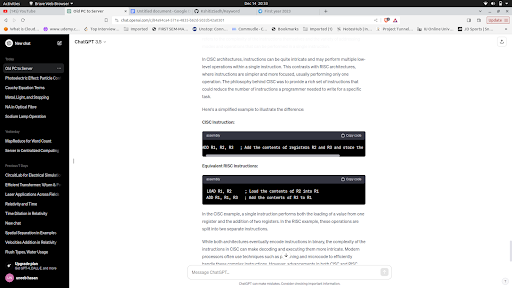
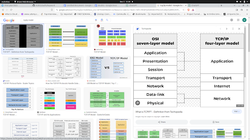
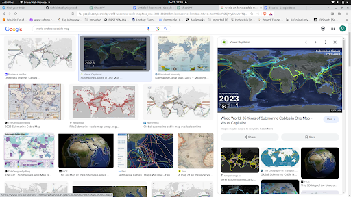
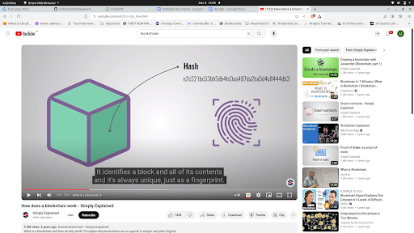
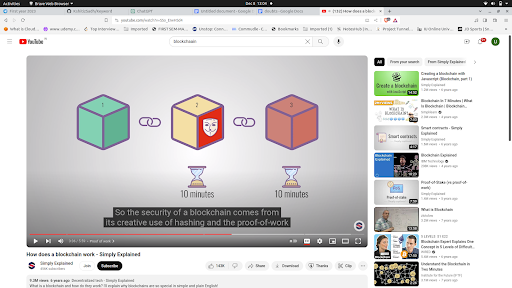
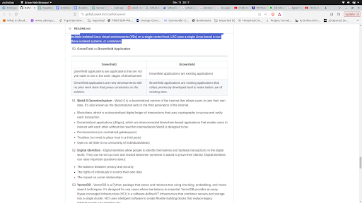
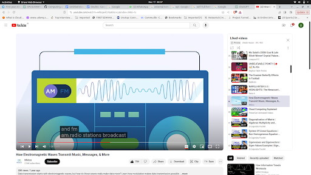
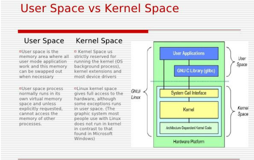
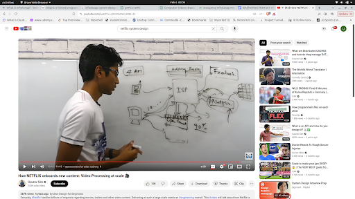

# Terminology Document

(INSTRUCTION SET ARCHITECTURE)-SET OF INSTRUCTIONS UNDERSTOOD AND EXECUTED BY PROCESSOR (interface bw software and hardware)

Architecture of processors.

OF 2 TYPES-

CISC-COMPLEX INFSTRUCTION SET COMPUTER
HANDLES LARGE INSTRUCTIONS (ALL INSTR AT ONCE WHICH INCREASES CLOCK CYCLE).eg-x64,AMD

RISC-REDUCED INSTR SET COMPUTER
HANDLES SIMPLIFIED AND SPECIFIC INSTRUCTIONS
ONE AT A TIME.MORE EFFICIENT AND LESS POWER IS CONSUMED(USED IN MOBILE PHONES).eg-ARM
  

## Definitions 

RISC V - AN OPEN SOURCE ISA. SAME CHARACTERISTICS AS RISC

KERNEL- COMMUNICATION B/W HARDWARE AND SOFTWARE THROUGH A SYSTEM CALL.(CPU AND HARD DISK).KERNEL REQUIRES LOW LEVEL LANGUAGE FOR EFFICIENT COMMUNICATION.device drivers

DNS-DOMAIN NAME SYSTEM.CONVERTS A DOMAIN NAME TO IP ADDRESS.EG-WWW.XYZ.COM,gmail.com

REGISTERS-SMALL HIGH SPEED STORAGE LOCATIONS TO STORE DATA TEMPORARILY.

VOLATILE MEMORY-IS LOST WHEN PC TURNED OFF(ram,registers).EG-BRAVE BROWSER RESTORES TAB.
IT STORES INITIALLY ON RAM BUT AFTER OFF ITS TRASNFERRED TO NON VOL MEMORY

HDD STORES DATA MAGNETICALLY ON A ROTATING (HARD DISK).STORES FOR A LONGER TIME THAN SSD WHICH STORES ELECTRONICALLY(SMALL AMOUNT OF CHARGE).HDD REQUIRES POWER ONLY ONCE.SSD SMALL AND FASTER.

SWITCH-eg- router can be connected to computer by switch.CONNECTS AND TRANSFERS DATA PACKETS BETWEEN DEVICES (OSI LAYER 2)AND router directs data packets to less traffic routes(OSI LAYER 3). Router also does MODEM WORk.ONCE THE DATA PROCESSED BY ROUTER SWITCH JUST TRANSFERS IT.ROUTER CAN ALSO DO SWITCH’S ROLE.router forwards/routes the packets.
Switch handles the data traffick
#no router no wifi/network
###Modulation:
Digital to Analog Conversion: Modems convert digital signals generated by computers or other digital devices into analog signals suitable for transmission over analog communication channels, such as telephone lines.

The "Swap" row in the output of the free command provides information about the swap space on your system. Swap space is a designated area on a storage device (usually a hard disk or SSD) that the operating system uses as virtual memory when the physical RAM is full.The concept of swap space is used to extend the effective size of the system's memory. When the physical RAM is fully utilized, the operating system can move less frequently used data from RAM to the swap space, freeing up space in RAM for more active processes. 

CACHE MEMORY- VOLATILE.STORES FREQUENTLY ACCESSED APPS,DATA.REDUCES TIME TO ACCES THE DATA

Ethernet port-connects the router and computer to transfer data(within lan)

Wan port- it connects the pc to the internet

Mac address-12 alphanumerics.given to every part that helps in data communication like switch router printers speakers router etc in a network.(given to nic).osi layer 2

Ip address-  Not to a cpu,memory, hard drive or memory.only to device that helps in data communication(same like mac address) like nic switch router.osi layer 3
Ipv4,ipv6. Assigned by an isp.
1)static
2)dynamic(changes over time)  
#local ip-within a local network
Private ip-home devices phones,pc,printer.not visible to others
Public ip-public servers like public wifi,gmail,amazon,whatsappetc

Nic- connects a network with a computer. Comes at osi layer 2 after osi at layer 3 routes the data.so it allows the data to enter the system after some routing and examination.

Digital signal- 0s and 1s binary.do not get affected by sound and temp
Analog signal -  some physical qty is made varying to graph it

***2.4ghz freq on wifi. 2.4 common for microwaves phones so overcrowded hence interference
2.4 has more range than 5ghz but less speed
AND analog→digital  == demodulation
Switch better hub outdated

Ethernet port- sends data from router->computer.eg-wifi

Isa- arch of cpu and how it processes the given instruction

Port number- its like mac address(but in software) but to identify network services for communication with webservers.ip address is also used.its a 16 bit integer.
Eg-browser with http(google) communicates through port 80 with server(web server)

https-443
Ftp-20 and 21
##when data is received/sent over a network it is directed to the specific port.
### [08:56, 29/11/2023] Uh: Https.googleport 80 will send request Google server to connect for a web page
 Uh: Doubt static and dynamic ip
Uh: IP address port number joined to access Google(ip)ftp/web page (port)
  

Ssl(replaced by tls)-secure socket layer-provides secure communication between client and server.with the help of ip address and port number. Uses cryptography . encrypts the data rather than ip address

gnome -software interface in linux based systems(giui)

Dual boot-2 os on 2 different partitions of hard drive

firmware-(like kernel) it is a software/code embedded in hardware(built-in their memory) to make it functioning.printers phones

Virtual machines-basically a computer.they have their own os,software,apps etc.
In virtualization in a single pc many vm are installed like linux windows.Users can have a Windows host operating system and run a virtual machine with Linux, or vice versa.
Their data is easily transferable from one pc to other.run multiple apps on 1 server
#containers do not require hypervisor they run on a os

Hypervisor-creates and runs the vms.its a software
Type 1-bare metal. The hypervisor contains the software requirements. Its made only on a bare metal hardware .no host os present only hardware and hypervisor.direct  access to hardware.(firmware)
Type2- built in a computer already having a host os. A new vm is created for running the  new os
Type 1 require less resources and has better performance. 
##while type 1 has direct acces to hardware type 2 doesnt rather the host os is an intermediate between hypervisor and hardware so type 2 has very indirect access

⇒vm’s run and manage a whole machine while containers only have dependencies and configurations for an app.A Vm has an ip address different than the host machine to for better communication from servers and between vms.

⇒server-its a computer/system that provides services and resources over a network to computers(clients).they have all the database and transfer the data to clients.

Processor=cpu which controls all the processes in a computer like transfer and storage of data,performs arithmetic(alu), coverts data into 0s and 1s
It can be 64 bit and 32 bit. 64 bit can deal with large data

Core-processor divided in 2 parts called core.for distribution of workload which increases its efficiency

Integrated circuit-a collection of wires resistors capacitors transistors to perform different operations like maths and data process. A processor is a type of ic

Fpga-field programme gate array-an ic that can be programmed/configured after its manufacturing.eg-it can be changed accordingly if its is risc/cisc architecture

Parallel processing-the workload divided between the components to make the work faster and efficient

Cryptography-securing a message(data) while communicating data.eg-dots/stars in password. The readable text is converted to symbols or codes
⇒cryp=hidden  graphy=writing

unicode -all forms of text and data are represented by a sybol by it.bit similar to ascii

Endpoint of communication-source/destination of data transferred over a network

  

Socket-they are endpoints for communication to send and receive data.they are communication pathways

tcp(transmission control protocol)-standard rules on establishment of networks and communication. Sending and receiving data over a network

Debian-an os similar to linux

VMware Workstation-its an app for making vms on a computer and allows pc to run multiple os for testing,development etc.its an example of type 2 hyp as it works on top of an existing os

vpn(virtual private network)-provides secure conncection over a public network by creating a communication channel
⇒VPNs can hide users' IP addresses VPNs can allow users to appear as if they are accessing the internet from a different location, helping bypass geographical content restrictions.

Iam-identity and access management -technologies and rules that ensure that the right person has the acces to resources

nginx(engine x)- a open source web server, load balancer for network traffic,reverse proxy server.

Apache- another web server
Daemons-they run in the background silenty and dont directly interact with user. Managed by os.eg-httpd
Eg-handle web servers email servers ftp (facilitate file transfer)

Thread- in a web server each incoming request is forwarded to a thread. Helps in achieving parallelism

ASICs - (Application-Specific Integrated Circuits)-an ic programmed for a specific function. They are not reprogrammable.
Used in consumer electronics phone pc

UDP - User Datagram Protocol(transport layer of osi layer)its connectionless(doesnt establish a connection) and inefficient data packet transfer but very fast and small.used in streaming(tv), online gaming etc.

Load Balance - Load balancing is the method of distributing network traffic equally across the servers.
server-client-server=computer, client=computers
Client request for data and resources from server for an application,web browser etc
Data transfer from eastern to southern states by either terrestrial cables,satellites or isp and data centers route the data. Also mountainous or desert areas rather use satellite which has relatively more latency resulting in signal delays.they are used to communicate broadcast channels to a dish AND national security purposes.
Gmail,google,youtube,gaming use underwater cables to connect users(clients) to servers across the globe.underwater cables have many backup routes and regular maintenance incase of corrosion;/other damage.they also have extra additional routes to route network traffic.

Cloud computing- cloud (building) contains large number of servers to stores all data of the client computers. High reliability of cloud provider,it also has backed up data.any loss of data cloud provider responsible .eg-aws.ibm.alibaba for netflix,online games,gmail.
* Infrastructure as a Service (IaaS) : Amazon Web Services (AWS), Microsoft Azure, Google Compute Engine (GCE), IBM Cloud.users can rent or lease virtualized computing resources(netflix series resources and related watch all data) instead of investing in and maintaining physical hardware.
* Platform as a Service (PaaS) : Windows Azure, Google App Engine, AWS Lambda, Azure Functions.a cloud computing service model that provides a platform allowing customers to develop, run, and manage applications without dealing with the complexities of infrastructure management like the underlying  servers, storage, and networking, is all managed by the cloud provider. This allows developers to focus on building and deploying applications without the need to worry about hardware, operating systems, or other low-level details.eg-python,java node.js 
* Software as a Service (SaaS) : Salesforce, Shopify, MailChimp, Dropbox, Hubspot. users can access and use software applications hosted by a third-party provider without the need for installation or maintenance on their local devices.eg-netflix,zoom(both by aws)
 Cloud computers are scalable-means ability to adapt and handle increasing workload and perform efficiently in the growing demand.

Ssl certificate- given to website who has certified secure connection with user’s web browsers to their web servers over https.While https already provides a secure connection ssl provides authentication to a site to ensure they are who they claim tobe
Network Address Translation (NAT) is a technique used in computer networking to map private IP addresses to a single public IP address(as number of ipv4 are finite and limited). This allows multiple devices within a local network to share a single public IP address when communicating with resources on the internet. 

           Compiler-pehle sara code likho all process at once .compiles all the source code in high level lang is converted to machine lang.c++,PYTHON,java
Interpreter-it also translates high level lang into machine code but line by line.python,java script. IT DIRECTLY EXECUTES THE INSTRUCTION WITHOUT THE CODE TO BE COMPILED IN A PLACE.
WHILE INTERPRETER HAS EASY DEBUGGING IT IS SLOW AND TEDIOUS AS COMPARED TO A COMPILER.
JUST IN TIME(JIT)-HYBRID OF COMPILER AND INTERPRETER

Scheduling-the allocation of resources(especially the cpu and others depending on the process)to perform different processes and task. 

Hash- a hexadecimal value returned when given the hash function an input. Hash ensure security and never return the input from the output.used in passwords.ITS VALUE CHANGES COMPLETELY EVEN WITH THE SMALLEST CHANGES OF CONTENT.

Blockchain-in a bitcoin this block contains data of transactions sender receiver amt
The block also contains hash of previous block
  

  

Blockchain uses the three principles of cryptography, decentralization, and consensus to create a highly secure underlying software system
decentralization=everyone has same amount of authority/ownership
Consensus-before doing a transaction all the miners verify the transaction before its actually done
Types of computing-
* Desktop Computing - Desktop computing devices include workstations, personal computers, and network computing devices. A workstation or desktop personal computer does not have many resource restrictions when connected to a fixed network.
Centralised Computing - System where all processing and data storage is handled by a single, central device or system which is responsible for processing all requests and managing all data, and all other devices in the system are connected to it.eg servers
* Decentralised Computing - In decentralized systems, every node makes its own decision. The final behavior of the system is the aggregate of the decisions of the individual nodes. There is no single entity that manages request
   * Blockchain, Decentralized databases – Entire databases split into parts, Cryptocurrency. Not everyone will have same level of authorities or same roles.bitorrent also.
###they dont have a centralised server for file transfers of movies/games but they do have centralized server for storing all software and backups of users
* Distributed Computing - It is a collection of computer programs that utilize computational resources across multiple, separate computation nodes to achieve a common, shared goal. It relies on separate nodes to communicate and synchronize over a common network.main aim for parallel and fast processing and decentralised ki that data securit(if only at 1 computer and its lost and not 2zbacked up).eg-used to solve complex problems parallel processing like processors]. Multiplayer online games
* P2p networking=its a decentralised network of computers where data and its processing is distributed among the nodes. A node can act both as a server and client and hence they share and communicate data with each other.eg-decentralised computers and distributed computers
* edge Computing - It allows smart applications and devices to respond to data almost at the same time which is important in terms of business ad self-driving cars.It has the ability to process data without even putting it on a public cloud, this ensures full security.
* Basically connecting the centralised servers with servers near the place of use(edge) to lessen latency
   * Use Cases - In-hospital patient monitoring, Virtualised radio networks and 5G (vRAN), Cloud gaming
   * 

39. Port Forwarding - It allows computers or services in private networks to connect over the internet with other public or private computers or services.eg-mobile data hotspot.the router forwards/redirects to the device
##In summary, RAM is used for temporary and volatile data storage during the computer's active operation, while ROM contains firmware instructions required for booting. Databases, on the other hand, are used to store and manage persistent and structured data, providing a way for applications to interact with stored information over the long term.Data in a database is typically stored on non-volatile storage (like hard drives or SSDs) and is not lost when power is turned off.
     40   Cluster - a group of inter-connected computers or hosts that work together to support applications and middleware (e.g. databases). each computer/host referred as node and each node is assigned same task which help in efficiency and load balancing
41. api(application programming interface)-
42. Etcd-its a database to store data for a particular case securely.(key value store).data is consistent in each node . it hel  ps in storage of data in kubernetes.its open source
43 Ceph-built by redhat its open source, for storage of data
44. ovs(open virtual switch)-it makes the computer server a virtual switch so that vms can interact with physical networks, it works with hypervisor.

45. Rancher - Rancher is an open-source software platform that allows organizations to run containers in production. Rancher can be used to:
* Run containers in production
* Operate Docker in production
* Deploy and run clusters anywhere and on any provider
* Divide a cluster into separate "virtual clusters" that each have their own access control and resource quotas
46. Cilium - Cilium is a highly scalable Kubernetes Container Network Interface (CNI). It provides cloud-native networking connectivity, security, and observability for container-based workloads, such as in Kubernetes and Docker. It provides visibility and control over network traffic, and offers advanced security features and traffic control.(like only allowing authorized networks and monitoring movement of unnecessary networks,first priority first)
47. proxmox- Proxmox VE an open-source server management platform for enterprise virtualization(use of virtualization technologies in large scale by big organisations allowing multiple os to run on a machine) orchestrates the allocation and management of resources to create a well-organized and efficient virtualized environment. It ensures storage networking backups of vms and containers.
48. XEN - Xen is a free and open-source hypervisor that allows multiple operating systems to run on the same hardware at the same time. Xen inserts a virtualization layer between the system hardware and the virtual machines. Xen is a type-1 hypervisor, which means it can be installed directly on hardware without the need for a host operating system. 
49. LXC stands for Linux Containers. It's an open-source container platform that allows users to create and run multiple isolated Linux virtual environments (VEs) on a single control host. LXC uses a single Linux kernel to run these isolated systems, or containers.
50. 

51. Web3.0 Decentralisation - Web3.0 is a decentralized version of the internet that allows users to own their own data. It's also known as the decentralized web or the third generation of the internet.eg-blovkchains,brave browser
52. Digital Identities - Digital identities allow people to identify themselves and facilitate transactions in the digital world. They can be set up once and reused whenever someone is asked to prove their identity. 
53. VectorDB - VectorDB is a Python package that stores and retrieves text using chunking, embedding, and vector search techniques. It's designed for use cases where low latency is essential.uses hci
54. hci-s a software-defined IT infrastructure that combines servers and storage into a single cluster.Saving, searching, and managing textual data with associated metadataManaging, querying, and retrieving high-dimensional vector data efficientlyWorking with vector data just like how you work with regular Python objectsA comprehensive suite of CRUD (Create, Read, Update, Delete) operations Robust scalability options
55. eBPF-Extended Berkeley Packet Filter. It's a lightweight virtual machine that runs sandboxed programs in a Linux kernel. eBPF allows programs to run without modifying the kernel source code or installing any additional modules. It's used to:
   * Extend the capabilities of the kernel
   * Control, monitor, and analyze system behavior
   * Attach small, efficient programs to various kernel hooks
   * Run programs upon triggering of an event
   56. DHCP - Dynamic Host Configuration Protocol (DHCP) is a network protocol that automatically assigns IP addresses to devices on a network. DHCP uses a client-server architecture to provide configuration information such as: IP address, Default route, DNS server addresses, Subnet mask, Default gateway.
   57. Terraform - Terraform is an open-source tool that automates infrastructure tasks. It's used by DevOps teams to provision cloud resources. Terraform allows users to:
   * Build infrastructure through code
   * Manage infrastructure, platforms, and services
   * Build, change, and version infrastructure safely and efficiently
   * Automatically manage configuration, plugins, and state
   * Add all config files into a VCS to safely manage and track changes
   58. TAP - A network tap (TAP) is a hardware device that allows you to monitor and access data that is transmitted over a network. TAP stands for "Traffic Access Point" or "Test Access Point". Network taps are typically used in network security applications to:
   * Monitor traffic
   * Identify malicious activity or security threats
   * Enable monitoring and analysis without interrupting data transmission
   59. CNI - Container Network Interface (CNI) is a framework that configures networking resources dynamically.It enables communication and connectivity between containers and external networks. CNI uses a group of libraries and specifications written in Go. The plugin specification defines an interface for:
   * Configuring the network
   * Provisioning IP addresses
   * Maintaining connectivity with multiple hosts
   60. Flannel-example of cni
   61. Overlay networking is a method of using software to create layers of network abstraction on top of a physical network. These layers can be used to run multiple separate, virtualized network layers. The purpose of an overlay network is to:
   * Add missing functionality without a complete network redesign
   * Provide new applications or security benefits
   * Deploy flexible services based on ever-changing connectivity and mobility demands of the endpoints and applications
   62. a tunnel is a connection between two computer networks that allows data to be sent from one network to another through an encrypted link. Tunneling works by encapsulating packets, or wrapping packets inside of other packets. Tunneling is used to:
   * Transfer data securely from one network to another
   *    63. TUN - TUN stands for network TUNnel. It's a virtual interface that simulates a network layer device. TUN operates on layer 3 of the OSI model TUN can tunnel data packets of varied nature
   64. KubeVirt - Basically an extension of kubernettes. KubeVirt is an open-source project that allows virtual machines (VMs) and containerized workloads to coexist within Kubernetes clusters. KubeVirt allows you to:
   * Provision, manage, and control VMs simultaneously with container resources
   * Integrate with existing Kubernetes deployments seamlessly
     65. k8s(Kubernetes) - Kubernetes automates operational tasks of container management and includes built-in commands for deploying applications, rolling out changes to your applications, scaling your applications up and down to fit changing needs, monitoring your applications, and more—making it easier to manage applications.
66.Huge pages, also known as large pages, are a memory management feature used in computer operating systems to optimize the utilization of physical memory. The concept of huge pages is particularly relevant in the context of virtual memory systems and is often utilized for improving the performance of applications that require large amounts of memory. 
67. .PAT - Port Address Translation (PAT) is a network device feature that translates TCP or UDP communications between hosts on a private network and hosts on a public network. PAT allows a single public IP address to be used by many hosts on the private network. PAT works by:
   * Assigning each device a unique port number.
   * Routing incoming traffic accordingly.
68. Soc(system on  a chip)=s an integrated circuit that incorporates a majority of components present on a computer. As the name suggests, it is an entire system fabricated on a silicon chip. The beauty of an SoC is that it integrates all the components on a single substrate
69. Deploying:Deploying is the process of making a developed application available and operational for end-users.,Building: The final version of the application is built, typically as executable files or packages.monitoring and updating for issues.

70. Development:
Development refers to the process of creating and building a software application. During the development phase:
Involves coding,configure-put themes,fonts,language,connecting databases,other customisationsetc,.Version Control: Developers often use version control systems to track changes to the codebase,Documentation: Documentation is created to provide insights into the codebase, 
71.biggest Q)how data carried by light(an em wave).its done by shift keying.basically changing the frequency,amplitudeor phase value of wave to represent 0 or 1.  
Eg-radio am or fm. Amplitude modifier or frequency modifier

72. wifi=wireless fidelity(more of a brand name)                                                          while ethernet is wired(cat6,5) connected between a router and the device(switch maybe involved to interconnect) and its usually faster and obviously wired so more safer. Hence ethernet better for fixed devices(pcs)
73. Q)pc doesnt connect to mobile hotspot bcz it has an ethernet port and wire connected to router. Since its wired(NOT WIRELESS)no nic required.
##ethernet port=rj45
##nic comes in osi layer 2,it allows other networks like printers,speakers to also connect,and nic sends the data from 1 pc to another..
74. Gpu-its used to enhance graphics/quality of videos or image or games.also helps in processing videos and images(brightness of pixel for max quality).its inside a graphic card and is like a mini computer having its own gpu(processor) and its own ram(v-ram)
As compared to a cpu its has around 1000s of cores which are less powerful bcz they dont have to do difficult calculations but more in numbers only..
75.DPU- A data processing unit (DPU) is a programmable computer processor that integrates a CPU with network interface hardware. DPUs are also known as "IPUs" (infrastructure processing units) or "SmartNICs".DPUs are used in data centers to:
   * Move data around
   * Handle networking functions
   * Relieve the CPU from data processing jobs
76. Tpu(tensor processing unit)-helps in graphics by doing matrix operations and machine learning of neural networks.
qpu(quantum processing unit)-not there yet but will involve quantum entanglement
77. Operating Systems
   * An operating system is a set of programs that enables a user to operate and interact with a computer.
Types of OS
   * Batch OS(Payroll System, Bank Statements )
   * Time-sharing or multitasking OS(UNIX,Linux,Windows)
   * Distributed OS(Cloud Computing)
   * NetworkOS(NOS)-It is software that connects multiple devices and computers on the network and allows them to share resources on the network.
   * Real-time OS(Airline reservation systems, Heart pacemakers,anything that needs immediate reponse)
   * Mobile OS(Android,GrapheneOS,Window phone,etc)
   * 78. eBPF-Extended Berkeley Packet Filter. It is a lightweight virtual machine that runs sandboxed programs in a Linux kernel. eBPF is a Linux kernel technology that allows engineers to build programs that run securely in kernel space.
79. PCIe(Peripheral Component Interconnect Express) - It is a high-speed serial computer expansion bus standard that connects various hardware devices, such as graphics cards, network cards, storage devices, and other peripherals, to the motherboard of a computer. PCIe provides a faster and more efficient data transfer.PCIe operates on a point-to-point topology, allowing multiple devices to connect to a single motherboard simultaneously
80. usb cables-used to connect webcams,keyboards,mouse,printers,red gear controller to motherboard for communication and data processing by cpu. 
81. Usb A- for small devices keyboards Usb B-for large devices monitors usb c-can be used as both as host and server
82. Sata cables connect hard drives and ssd to motherboard
83. Bus standards are protocols and specifications that define how different components within a computer or electronic system communicate with each other.
84. CONTAINERS::    LXC- LXC is an open-source project of LinuxContainers.org. The aim of LXC is to provide isolated application environments that closely resemble virtual machines (VMs) but without the overhead of running their own kernel.lxc run on host and host kernel too.
85. Rkt-like lxc a containerisation technology.it uses modularity (bifurcates a single system into multiple smaller parts known as modules).unlike docker it can run without root user powers and a central daemon hence more secure.
86. Podman and Docker are both containerization tools that allow users to create, manage, and deploy containers. Pdm doesnt have central daemon and doesnt requires root user  
87. runc-It is a command-line tool that allows users to spawn and run containers,creating, starting, stopping, and deleting them
88. ORCHESTRATION CONTAINERS:: Kubernetes-Kubernetes orchestration is an open-source container orchestration system that automates the deployment, management, and scaling of applications. It can be used with or without Docker.
   * Rancher-Rancher is a Kubernetes management tool that can be used to deploy and run clusters anywhere and on any provider.
   * Amazon EKS-Amazon Elastic Kubernetes Service (Amazon EKS) is a managed Kubernetes service that makes it easy for you to run Kubernetes on AWS and on-premises.
   * Dockerswarm- Docker Swarm is a container orchestration tool that allows you to manage a cluster of Docker hosts or run docker applications. It is a lightweight and easy-to-use tool that is well-suited for small and medium-sized deployments.
   * Apache Mesos- Mesos brings together the existing resources of the machines/nodes in a cluster into a single pool from which a variety of workloads may utillize. Also known as node abstraction, this removes the need to allocate specific machines for different workloads.
   * Amazon ECS-Amazon Elastic Container Service (Amazon ECS) is a fully managed container orchestration service that helps you easily deploy, manage, and scale containerized applications.
89.   

 user space is essentially where user-level applications and processes operate, handling tasks like word processing,data processing, web browsing, and other everyday activities.but cant access kernel space things like memory management data storage and processing,changing system configurations(network configs like checking and securing it then only allow it to run).

Kernel is interface between user apps and direct hardware access. Kernel helps to communicate user apps system call to direct hardware access. But a superuser cant directly access hardware without kernel req.

90 

—----------------------------------------------------------------------------------------------------------------

Let's use an analogy to explain virtual memory:
Imagine a Desk with Papers:
   * Physical Desk Space (RAM):
   * Think of your physical desk space as your computer's RAM (Random Access Memory).
   * You have limited space on your desk to work on tasks (running programs).
   * Infinite Desk Extension (Virtual Memory):
   * Now, imagine an infinite extension of your desk, representing virtual memory.
   * This extension can hold more papers (data and code) than your physical desk.
   * Page Table (Desk Organizer):
   * Your desk organizer is like the page table managed by the operating system.
   * It helps you keep track of which papers are on your physical desk and which are on the infinite extension.
   * Page Fault (Missing Paper):
   * When you need a paper that's not on your physical desk, you refer to your desk organizer.
   * If it's in the infinite extension, you fetch it. This is like a page fault.
   * Swapping Papers (Disk Space):
   * If your physical desk is full, you might move some papers to a filing cabinet (disk space).
   * Swapping papers between your desk and the cabinet is similar to moving data between RAM and disk.
   * Efficient Space Usage:
   * The desk plus the extension (RAM plus virtual memory) allows you to work on more tasks efficiently.
   * You can always access any paper, but you don't need all of them on your desk at once.
In summary, virtual memory is like having an infinite desk extension (beyond physical RAM) to manage more papers (data and code) efficiently. The page table (desk organizer) keeps track of where everything is, and swapping papers between the desk and filing cabinet (disk) helps you make the most of your desk space.

Let's use the analogy of sending physical letters and the client-server model to explain why WhatsApp Pay is peer-to-peer (P2P).

### Analogy: Sending Physical Letters

Imagine you and your friends regularly exchange letters. Each person has their own mailbox, and you can drop a letter directly into your friend's mailbox. This is akin to peer-to-peer communication because you interact directly with your friends without involving intermediaries.

Now, let's extend this analogy to the client-server model:

### Analogy: Client-Server Model

1. **Client-Server Model:**
   - Think of a traditional postal service where you write a letter (the client), and you send it to a central post office (the server). The post office then routes the letter to your friend's mailbox.
   - In this model, you rely on an intermediary (the post office or server) to facilitate the communication between you and your friend.

2. **WhatsApp Pay as P2P:**
   - Now, let's introduce WhatsApp Pay. With WhatsApp Pay, you can think of each person having their own "digital mailbox" within the WhatsApp app. When you want to send money, you can directly transfer it from your "mailbox" to your friend's "mailbox" without involving an external intermediary (like a bank).

3. **Comparison:**
   - **Client-Server (Traditional Banking):**
     - *Process:* You visit a bank (server) to send money. The bank facilitates the transaction and updates both your and your friend's accounts.
     - *Analogous to:* Using a central post office to send a letter.

   - **P2P (WhatsApp Pay):**
     - *Process:* You initiate a payment directly from your WhatsApp app (client) to your friend's WhatsApp app (peer). WhatsApp facilitates the transaction, but it doesn't involve external banking infrastructure for P2P transactions.
     - *Analogous to:* Dropping a letter directly into your friend's mailbox.

### Key Points:

- **P2P Analogy:** In the P2P scenario, the direct exchange between individuals resembles sending letters directly to each other's mailboxes.

- **Client-Server Analogy:** In the client-server scenario, the intermediary (bank or post office) facilitates the communication and processing of the transaction.

- **WhatsApp Pay:** By being P2P, WhatsApp Pay allows users to send money directly to each other within the app, similar to sending letters directly to friends' mailboxes without involving external postal services.

Both client-server and P2P models have their advantages and use cases, and the choice depends on factors such as efficiency, trust, and the nature of the transaction. P2P models like WhatsApp Pay often emphasize direct user interactions and simplicity in financial transactions.

No, hashed and encrypted are not the same, although both are cryptographic techniques used to protect data. Here's how they differ:

### Hashing:

- **Purpose:** Hashing is a one-way function used to generate a fixed-size string of characters (hash value) from input data of any size.
- **Irreversibility:** Hashing is irreversible, meaning you cannot retrieve the original input data from the hash value.
- **Deterministic:** For the same input data, a hash function always produces the same hash value.
- **Use Cases:** Hashing is commonly used for password storage, data integrity verification, and generating unique identifiers (e.g., hash tables, digital signatures).
- **Example Algorithms:** MD5, SHA-1, SHA-256.

### Encryption:

- **Purpose:** Encryption is a reversible process used to encode plaintext data into ciphertext using an encryption algorithm and a secret key.
- **Reversibility:** Encryption is reversible, meaning you can decrypt the ciphertext back into the original plaintext using the decryption algorithm and the same secret key.
- **Confidentiality:** Encryption ensures confidentiality by preventing unauthorized parties from accessing the original data without the decryption key.
- **Use Cases:** Encryption is commonly used for securing sensitive data during transmission or storage, such as in secure communication protocols (HTTPS, SSL/TLS), disk encryption, and database encryption.
- **Example Algorithms:** AES (Advanced Encryption Standard), RSA (Rivest-Shamir-Adleman), DES (Data Encryption Standard).

### Differences:

1. **Reversibility:** Hashing is irreversible, while encryption is reversible.
2. **Use Cases:** Hashing is typically used for data integrity and identification, while encryption is used for data confidentiality.
3. **Output Size:** Hash functions produce fixed-size hash values, while encryption algorithms may produce ciphertext of variable length.
4. **Security Properties:** Encryption provides confidentiality through the use of secret keys, while hashing provides data integrity and verification but does not offer confidentiality.
5. **Collision Resistance:** A good hash function should have low collision probability (i.e., producing different hash value for different input data), whereas encryption algorithms aim to prevent decryption without the proper key, regardless of collisions.

In summary, while both hashing and encryption are cryptographic techniques used to protect data, they serve different purposes and have distinct properties and use cases.

Summary-   
crypto
Grpc 
Clientserver p2p
Ms and mono
Whatsapp netflix work
System design
P2p
HTTP/2-
Revised version of HTTP1, a network protocol used www.
Developed by HTTP working group of the internet engineering task force(ietf)
The standardization effort is supported by Chrome, Opera, Firefox, Internet Explorer 11, Safari, Amazon Silk, and Edge browsers
HTTP/2 introduces a new framing layer that allows multiple requests and responses to be sent and received in parallel over a single TCP connection
HTTP/2 uses a binary framing format instead of plain text, which was used in HTTP/1.1. This binary format is more efficient to parse and reduces overhead, resulting in faster processing and improved performance.
Server Push: HTTP/2 introduces server push, a feature that allows the server to send resources to the client proactively, without waiting for the client to request them explicitly. This capability can improve page load times by allowing the server to push critical resources (e.g., images, scripts) to the client before they are requested.
stream Prioritization: HTTP/2 supports stream prioritization, allowing clients to specify the relative importance of different resources. This feature enables more efficient resource allocation and can improve the overall user experience

Websockets-
WebSockets is a communication protocol that provides full-duplex, bidirectional communication channels over a single TCP connection, enabling real-time data transfer between clients and servers.

W3C(World Wide Web Consortium)-
A community who work together to make rules for how websites should work. This help web developers to create websites following the guidelines for it to be used.

RFC(request for comments)-RFCs are documents published by the IETF that describe various aspects of the internet, including protocols, procedures, and best practices. They cover topics like how data is transmitted over the internet, how emails are sent, and how web pages are accessed. RFCs are like the instruction manuals for how different parts of the internet work.

European Telecommunications Standards Institute-
ETSI develops standards and specifications for a wide range of ICT technologies. These standards cover areas such as telecommunications, broadcasting, networking, cybersecurity 
NIST(National Institute of Standards and Technology)-
It develops and maintains standards, guidelines, and best practices in various fields, including cybersecurity, information technology, manufacturing, and metrology (the science of measurement). 

   1. Http not secure but https secure bcz it has encryption and tls certificate which secures communication between s and c.
   2. Bin folder -(contains executable non human readable files necessary for app to run) Many software applications create a "bin" folder during installation to store executable files and related binaries. These files are essential for the proper functioning of the application.
   3. Microservices- dividing the application or software into small independent services, so that resources are allocated according to the demand of the services  monolithic architecture- all the application/software stored and processed at a single place(not divided unified).it has a centralised system.
   4. Microservices are decoupled that means they are independent and changes in one wont effect the working of other.
Hence instead of scaling the whole application its services can be scaled with demand.This is done by using virtualization(vms) and containers to get maximum output from the server. Each of these containers have a microservice, these containers are managed and deployed by k8s. Microservices communicate through api s.
API-set of protocols and rules used by k8s clusters to communicate with each other by client-server architecture. Its the interface between control plane and worker nodes.
a RESTful API allows clients to access and manipulate resources (e.g., data, files, services) on a server using standard HTTP methods (e.g., GET, POST, PUT, DELETE). The term "REST" emphasizes the architectural principles of simplicity, scalability, and uniformity in designing web services
K8s cluster consists of-
1)control plance node-
Api server- it controls the state of the cluster (means the cluster works in the ways specified in its configurations and resources).
Controller manager- control the state of the cluster ensure it remains in the working state.eg-if 1 node goes down it replaces it
Scheduler-assigns workload to worker nodes based on available resources
Etcd-stores configuration data
2)worker nodes-
   * Kubelet: Ensures that containers are running in a Pod. It communicates with the control plane.
   * Container Runtime: Software responsible for running containers, such as Docker or containerd.
   * Kube Proxy: Maintains network rules and allows communication across Pods in the cluster.
   * Pod: The smallest deployable unit in Kubernetes, consisting of one or more containers. Provides shared resources and storage

Rpc = communication bw microservices
Network proxy- an intermediate server that sits between clients and servers for communication between them.It improves privacy, security, and performance in the process.provides load balancing
Gateway-interconnects 2 networks .basically a network proxy that doesnt modify data and communications. Though it does do security checks and routing(traffic manage).
Cryptography-securing a message(data) while communicating data.eg-dots/stars in password. The readable text is converted to symbols or codes.used in blockchains

P2p networking=its a decentralised network of computers where data and its processing is distributed among the nodes. A node can act both as a server and client and hence they share and communicate data with each other.eg-decentralised computers and distributed computers

system design serves as a blueprint or detailed plan for developing an information system. It provides a comprehensive view of how the various components and modules of the system will be organized, how they will interact, and how data will be stored and processed. The design addresses different aspects of the system, including its architecture, data structures, user interfaces, and more.

rpc - they are a set of protocols used for communication between microservices.based on the client and server architecture. Function running on a client is executed on another remote machine. The client sends a request for this.client=caller   server=executer
eg-grpc 
They also have protocol buffers for language agnostic encoding of data and instructions.

whatsapp-  

It uses protocols like-

MQTT (Message Queuing Telemetry Transport)
XMPP (Extensible Messaging and Presence Protocol)
WebRTC (Web Real-Time Communication)
DTLS (Datagram Transport Layer Security)

Uses nosql databases for scaling and dealing with the dynamic nature of the app.

Uses tokens for authentication of users

Web sockets for transfer of data and communication between user and server.

on installation, it creates a user account using the user's phone number as the username 

Uses opus for voice calls

Presence servers for online/offline status of the user
WhatsApp Payments (marketed as WhatsApp Pay) is a peer-to-peer money transfer feature

Uses end-end encryption where message can only be decrypted by the receiver.a special encryption key is given to both to authenticate the decryption of the message.

Netflix-

  

Netflix main servers=US

Netflix is known for its loosely coupled and highly scalable microservice architecture.

To make the videos viewable on different devices, Netflix performs transcoding or encoding, which involves finding errors and converting the original video into different formats and resolutions.
Netflix offers a unified API aggregation layer at the edge(uses edge computing)The aggregation layer can handle tasks such as routing requests, data transformation, and combining responses from various APIs.

  

multiple APIs are brought together and presented through a single interface.

But for large market like india it has cache servers(open connect) in that country.The main servers from Usa send the video data(mp4 files) to the cache.

It uses adaptive bitrate streaming.eg-higher video quality for larger devices like laptops tv

When the request arrives at the endpoint it calls the other microservices for required data and these microservices can also request the data from different microservices. After that, a complete response for the API request is sent back to the endpoint. 

ELB in Netflix is responsible for routing the traffic to front-end services. ELB performs a two-tier load-balancing scheme where the load is balanced over zones first and then instances (servers).

ZUUL is a gateway service that provides dynamic routing, monitoring, resiliency, and security. It provides easy routing based on query parameters, URL, and path

UBER-

Earlier Uber was built on the “monolithic” software architecture model.
Uber uses the Google S2 library. DISCO divides the map into tiny cells with a unique ID to each cell(cells are for example 3km) 
All the active cabs keep on sending the location to the server once every 4 seconds through a web application firewall and load balancer
Demand service receives the request of the cab through a web socket and it tracks the GPS location of the user. It also receives different kinds of requirements such as the number of seats, type of car, or pool car.
These tiny cells’ responsibilities will be divided into different servers lies in multiple regions (consistent hashing).
The dispatch system (including supply, demand, and web socket) is built on NodeJS. NodeJS is the asynchronous and event-based framework that allows you to send and receive messages through WebSockets whenever you want.

Ringpop uses RPC (Remote Procedure Call) protocol to make calls from one server to another server.
Ringpop also uses a SWIM membership protocol/gossip protocol that allows independent workers to discover each other’s responsibilities. This way each server/node knows the responsibility and the work of other nodes.
Redis for both caching and queuing. Some are behind Twemproxy (which provides scalability of the caching layer). Some are behind a custom clustering system.
by using drivers' phones as a source of trip data and sending encrypted state digests, Uber ensures that even in the event of a data center failure, the backup data center can quickly get the latest trip information from the driver's phone app

CHAT GPT-

Uses llm(large language model).

  

To scale the system to millions of users, we need to implement some optimizations

Load balancers

Horizontal scaling

Data partitioning allows splitting conversation data by bot type or user groups. This limits data sizes for higher performance.
Cache memory

User enters text in the chat widget on the frontend and hits send. This triggers a request.
The request is sent to the backend application layer. It contains the user input text, user ID, conversation context, etc.
The application layer handles parsing the input, extracting key entities and intent. It adds metadata like the user ID and bot profile.
The request is routed to the appropriate bot model based on the user's chosen bot or context. This handles scaling to different model instances.
The model analyzes the input text using techniques like attention to identify relevant context. It generates a response text word-by-word using the conditional language model.
The raw response text is sent back to the application layer. Here additional formatting is applied to display it properly in the chat interface. Images/links can also be inserted if needed.
The formatted response is returned to the user's chat screen and displayed. Websocket connection enables real-time updates.

     
     

          

\
